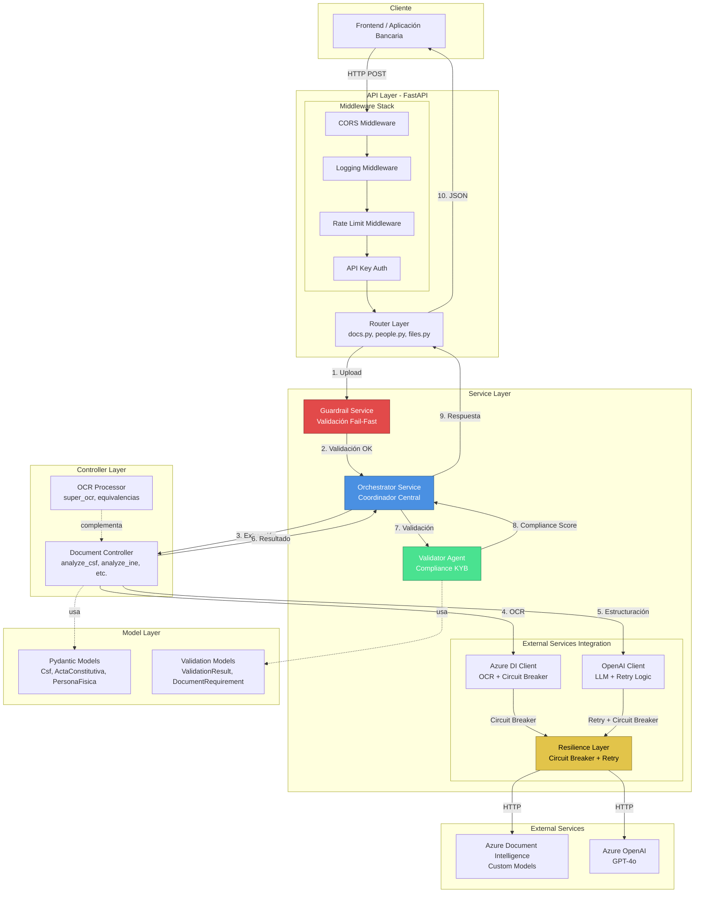
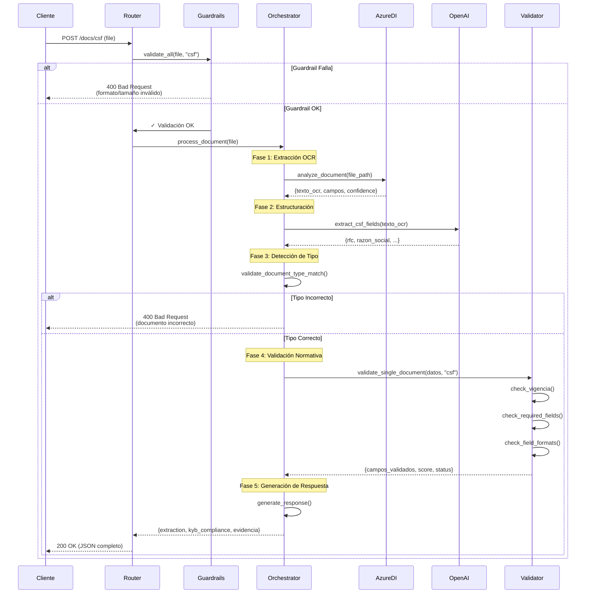

# Arquitectura del Sistema KYB (Know Your Business)

> **Documento de Arquitectura Técnica**  
> Sistema de automatización de procesos de onboarding empresarial  
> Versión: 1.3.0 | Fecha: 27 de febrero de 2026

---

## 1. Visión General del Sistema

El sistema KYB (Know Your Business) es una plataforma de automatización diseñada para transformar radicalmente el proceso de apertura de cuentas empresariales en el sector bancario mexicano. Mientras que el proceso tradicional puede extenderse hasta 50 días e involucra múltiples revisiones manuales de documentos, nuestra solución reduce este tiempo a aproximadamente 50 minutos mediante el uso inteligente de tecnologías de extracción automática de datos y validación normativa.

El corazón del sistema es un pipeline de procesamiento de documentos que combina tres capacidades fundamentales: **validación temprana de formato y estructura** (guardrails), **extracción inteligente de datos mediante OCR y LLM**, y **validación cruzada automatizada entre documentos + portales gubernamentales**. La plataforma se compone de **3 agentes independientes**:

| Agente | Puerto | Directorio | Responsabilidad |
|--------|--------|------------|------------------|
| **Dakota** | 8000 | `Dakota/kyb_review/` | Extracción de datos (OCR + GPT-4o) + validación individual |
| **Colorado** | 8001 | `Colorado/cross_validation/` | Validación cruzada (10 bloques) + portales gubernamentales |
| **Orquestrator** | 8002 | `Orquestrator/` | Coordinación automática del flujo completo |

Esta arquitectura permite procesar los 9 tipos de documentos requeridos para el onboarding —desde la Constancia de Situación Fiscal hasta poderes notariales— y generar un veredicto automatizado sobre la viabilidad del expediente.

La plataforma no busca eliminar por completo la intervención humana, sino optimizarla de manera radical. Aquellos expedientes que cumplan con todos los requisitos normativos (aproximadamente el 70% en ambientes productivos) se aprueban automáticamente, mientras que los casos que presenten discrepancias o campos faltantes se escalan a revisión manual con toda la información pre-procesada y categorizada por severidad. Este enfoque híbrido permite a los analistas concentrar su experiencia donde realmente aporta valor: en casos complejos que requieren juicio humano.

Desde una perspectiva técnica, el sistema se construye sobre **FastAPI** como framework web, integrándose con **Azure Document Intelligence** para OCR de alta precisión y **Azure OpenAI GPT-4o** para estructuración inteligente de datos no estructurados. La arquitectura sigue principios de **fail-fast** (rechazo temprano de documentos inválidos) y **resiliencia** (tolerancia a fallos de servicios externos mediante circuit breakers), garantizando operación estable en ambientes productivos de alta demanda.

El sistema maneja documentos críticos que van desde identificaciones oficiales (INE) hasta documentos notariales complejos (actas constitutivas, poderes, reformas), cada uno con sus propios requisitos de vigencia, protocolización y campos obligatorios. La capacidad de validar no solo la existencia de estos campos, sino también su conformidad con formatos legales específicos (RFC de 12 caracteres, CURP de 18, vigencias según normativa SAT), eleva el sistema más allá de un simple OCR hacia una solución de compliance automatizada.

---

## 2. Diagrama de Componentes

La arquitectura del sistema KYB se organiza en capas claramente diferenciadas, cada una con responsabilidades específicas. El siguiente diagrama ilustra cómo los componentes principales se relacionan entre sí para conformar el flujo completo de procesamiento.



### Descripción de Componentes Principales

**API Layer (Capa de Interfaz HTTP)**  
La entrada al sistema es una aplicación FastAPI que expone endpoints RESTful para cada tipo de documento. El router organiza las rutas bajo el prefijo `/kyb/api/v1.0.0/docs/` seguido del tipo de documento (`csf`, `ine`, `acta`, etc.). Antes de que cualquier request llegue a la lógica de negocio, atraviesa una pila de middleware que implementa concerns transversales: CORS para permitir requests desde el frontend, logging estructurado en JSON para observabilidad, rate limiting para prevenir abuso, y autenticación mediante API Key para seguridad.

**Service Layer (Capa de Servicios)**  
Aquí reside la inteligencia del sistema. El **Orchestrator Service** actúa como director de orquesta, coordinando el flujo completo: recibe el documento, delega la validación temprana al Guardrail Service, coordina la extracción OCR, invoca la estructuración con LLM, y finalmente solicita la validación normativa al Validator Agent. Este componente es stateless y puede procesar múltiples expedientes en paralelo.

El **Guardrail Service** implementa el patrón fail-fast: antes de realizar cualquier llamada costosa a Azure, valida que el documento tenga formato adecuado (PDF, JPG, PNG), tamaño permitido (5-50MB según tipo), y que no contenga amenazas de seguridad como path traversal. Un documento rechazado en este punto ahorra entre $0.01-0.02 de procesamiento Azure.

El **Validator Agent** es el guardián del compliance. Contiene la matriz completa de requisitos normativos mexicanos para personas morales: vigencias según tipo de documento (3 meses para CSF, 10 años para INE, sin vencimiento para Acta Constitutiva), campos obligatorios (RFC de 12 caracteres, CURP de 18, folio mercantil), y evidencia de protocolización notarial. Genera un compliance score que determina si el expediente es auto-aprobable.

**Integration Layer (Integración con Servicios Externos)**  
La comunicación con Azure requiere resiliencia. Implementamos **circuit breakers** independientes para Azure Document Intelligence y Azure OpenAI: después de 3-5 fallos consecutivos, el circuit se abre y los requests subsecuentes fallan inmediatamente durante 60-120 segundos, evitando cascading failures. Cada llamada está protegida con **retry con backoff exponencial**: 3 intentos con delays de 1s, 2s, 4s, más jitter aleatorio para evitar thundering herd.

**Controller Layer (Procesadores de Documentos)**  
Cada tipo de documento tiene un controlador especializado (`analyze_csf`, `analyze_ine`, `analyze_acta`, etc.) que conoce la estructura específica del documento y los campos a extraer. Estos controladores combinan la salida bruta de Azure DI (coordenadas de texto, confianza por campo) con prompts especializados de GPT-4o para estructurar datos en modelos Pydantic validados.

**Model Layer (Modelos de Datos)**  
Toda la información fluye a través de modelos Pydantic que garantizan type safety y validación automática. Modelos como `Csf`, `ActaConstitutiva`, `PersonaFisica` definen la estructura de datos extraídos, mientras que `ValidationResult`, `DocumentRequirement`, `SingleDocumentValidation` modelan el proceso de compliance.

---

## 3. Flujo de Datos

El viaje de un documento a través del sistema KYB es una historia de transformaciones sucesivas: de bytes crudos a texto estructurado, de texto a entidades semánticas, de entidades a veredictos de compliance. Entender este flujo es clave para comprender cómo el sistema genera valor en cada etapa.

### Fase 1: Recepción y Validación Inicial (Guardrails)

Cuando un documento llega al endpoint — digamos, una Constancia de Situación Fiscal vía `POST /docs/csf` — el primer obstáculo que enfrenta es el Guardrail Service. Este componente inspecciona los **magic bytes** del archivo (primeros 2KB) para verificar que el MIME type declarado coincida con el contenido real. Un PDF corrompido o un archivo HTML renombrado a `.pdf` será rechazado aquí mismo, en menos de 10ms, sin consumir recursos costosos.

El sistema valida tres aspectos críticos: **formato** (¿Es realmente un PDF/JPG/PNG?), **tamaño** (¿Está dentro del límite de 5MB para CSF?), y **seguridad** (¿El filename contiene path traversal como `../../etc/passwd`?). Cada tipo de documento tiene límites específicos: INE puede ser hasta 10MB, FIEL hasta 50MB (por ser ZIP con certificados), Actas hasta 50MB (documentos multipágina escaneados).

Si el documento pasa los guardrails, se guarda en el directorio temporal con un prefijo identificador (`csf_`, `ine_`, etc.) y un UUID para evitar colisiones. El path absoluto del archivo guardado se propaga al siguiente componente.

### Fase 2: Extracción OCR (Azure Document Intelligence)

El archivo guardado se envía a Azure Document Intelligence mediante una llamada HTTP multipart/form-data. Para INE, usamos un **modelo custom entrenado** (`INE_Front`, `INE_Back`) que conoce la estructura exacta de las credenciales mexicanas. Para documentos como CSF, Acta Constitutiva, Poder Notarial, usamos el modelo `prebuilt-layout` que es agnóstico pero identifica párrafos, tablas, y estructura de página.

La respuesta de Azure DI tarda entre 3-8 segundos según complejidad del documento. Retorna un JSON que contiene:
- **Texto completo extraído** (`content`): Todo el texto detectado por OCR
- **Campos estructurados** (para modelos custom): `{campo: {content, confidence}}`
- **Coordenadas de bounding boxes**: Ubicación exacta de cada palabra en el documento
- **Páginas y párrafos**: Jerarquía del texto

Esta respuesta cruda es valiosa pero insuficiente. Azure DI puede extraer "BANCO PAGATODO SA DE CV" pero no sabe que eso es el campo `denominacion_razon_social`. Aquí entra GPT-4o.

### Fase 3: Estructuración Semántica (Azure OpenAI)

El texto OCR se envía a GPT-4o con un prompt estructurado que describe el tipo de documento y los campos esperados. Por ejemplo, para CSF:

```
Analiza este texto OCR de una Constancia de Situación Fiscal mexicana.
Extrae los siguientes campos:
- rfc: RFC de 12 caracteres (personas morales) o 13 (físicas)
- denominacion_razon_social: Nombre completo de la empresa
- regimen_fiscal: Código y descripción del régimen fiscal
- domicilio_fiscal: Dirección completa
- fecha_emision: Fecha de emisión del documento
- estatus: ACTIVO o SUSPENDIDO

Retorna JSON con estructura exacta. Si un campo no existe, usar "N/A".
```

GPT-4o analiza el contexto semántico ("Esta empresa está en régimen 601" → `regimen_fiscal: "601 - General de Ley Personas Morales"`) y retorna JSON estructurado. Este paso agrega inteligencia: puede manejar variaciones en formato, abreviaturas, OCR imperfecto. El response parsing es robusto: si GPT retorna markdown con triple backticks, lo limpiamos; si JSON viene con trailing commas, lo corregimos con parse seguro.

El resultado de esta fase es un objeto Pydantic validado, por ejemplo `Csf(rfc="ABC123456789", denominacion_razon_social="...", confianza_global=0.92)`. Pydantic garantiza que el RFC tenga exactamente 12 caracteres, que las fechas sigan formato ISO, que los campos numéricos sean realmente números.

### Fase 4: Detección de Tipo de Documento (Scoring Adaptativo)

Antes de validar, el sistema verifica si el documento subido corresponde realmente al tipo esperado. Un usuario podría subir accidentalmente un Poder Notarial al endpoint `/docs/csf`. El algoritmo de detección analiza tres señales:

1. **Campos requeridos** (peso 50%): Si se esperaba CSF, ¿se encontraron `rfc` y `regimen_fiscal`?
2. **Campos opcionales** (peso 30%): ¿Aparecen campos adicionales esperados como `denominacion_razon_social`?
3. **Keywords en texto OCR** (peso 20% o 100%): ¿El texto contiene palabras clave como "SAT", "SITUACIÓN FISCAL"?

El scoring es **adaptativo**: cuando el extractor de CSF procesa un documento completamente diferente (ej: INE), retorna 0/9 campos encontrados. En este escenario, el peso de keywords salta al 100% (en vez de 20%) porque son la única señal confiable. El texto de una INE contiene "INSTITUTO NACIONAL ELECTORAL", "CREDENCIAL PARA VOTAR", "CURP" — palabras que coinciden 5/5 con las keywords de INE. Score INE: 1.0. Score CSF: 0.05. Veredicto: documento incorrecto detectado.

Este mecanismo ahorra costos (no se procesa validación si el documento es incorrecto) y mejora UX (el usuario recibe error inmediato: "Subiste una INE al endpoint de CSF").

### Fase 5: Validación Normativa (Validator Agent)

Con datos estructurados y tipo confirmado, comienza la validación seria. El Validator Agent implementa la matriz completa de requisitos normativos mexicanos:

**Vigencia**: Cada documento tiene reglas específicas. CSF vence a los 90 días (3 meses) desde emisión. INE tiene vigencia de 10 años desde emisión o hasta la `vigencia` impresa en la credencial, lo que ocurra primero. Acta Constitutiva nunca vence (`SIN_VENCIMIENTO`). FIEL debe tener `vigencia_hasta` > fecha actual.

**Campos requeridos**: CSF necesita RFC, razón social, régimen fiscal, domicilio fiscal, fecha de emisión. INE necesita CURP, nombre completo, fecha de nacimiento. Acta Constitutiva exige folio mercantil, fecha de protocolización, nombre del notario, denominación social. La ausencia de cualquier campo requerido es error crítico.

**Formato de campos**: RFC debe ser exactamente 12 caracteres para persona moral (13 para física). CURP debe ser 18 caracteres con formato específico: `[A-Z]{4}\d{6}[HM][A-Z]{5}[A-Z0-9]\d`. Si Azure DI no extrae el CURP pero existe en el texto OCR, aplicamos regex de fallback (confianza 90%).

**Protocolización**: Documentos como Acta Constitutiva, Poder Notarial, Reforma de Estatutos deben tener evidencia de protocolización notarial: número de escritura, nombre del notario, número de notaría, fecha de otorgamiento. La ausencia de estos elementos invalida el documento para efectos legales.

**Estatus activo**: La CSF debe mostrar `estatus: "ACTIVO"` en el padrón del SAT. Una empresa suspendida no puede abrir cuentas.

Cada documento recibe un diccionario `campos_validados` que mapea cada requisito a su estado:

```json
{
  "vigencia": "compliant",
  "campo_rfc": "compliant",
  "campo_rfc_formato": "compliant",
  "campo_estatus": "compliant",
  "campo_denominacion_razon_social": "compliant",
  "campo_domicilio_fiscal": "compliant",
  "campo_regimen_fiscal": "non_compliant"  // ← Falta este campo
}
```

El **compliance score** es la proporción de campos "compliant": 6/7 = 85.7%. El status general es el más bajo encontrado: si hay un campo `non_compliant`, el documento es `non_compliant`.

### Fase 6: Veredicto Final

Con todos los documentos procesados, el Orchestrator agrega los resultados individuales y genera un veredicto según reglas de negocio:

- **APPROVED**: 0 errores críticos, 0 errores altos, compliance score > 90%
- **REVIEW_REQUIRED**: 1-2 errores altos, o compliance score 70-90%
- **REJECTED**: 3+ errores críticos, o compliance score < 70%

El response JSON que regresa al cliente contiene:
- **extraction**: Datos extraídos de cada documento (CSF, INE, Acta, etc.)
- **kyb_compliance**: Resultado de validación con campos validados
- **evidencia**: Página y párrafo donde se encontró cada campo
- **errores**: Lista de errores categorizados por severidad
- **recomendaciones**: Acciones sugeridas (ej: "Renovar CSF vencida")

Este JSON rico permite al frontend renderizar dashboards visuales: badges verdes para campos compliant, rojos para non-compliant, timeline de procesamiento, drill-down a evidencia específica.

### Diagrama de Flujo de Datos Detallado

El siguiente diagrama ilustra el recorrido completo de un documento desde su recepción hasta la generación del veredicto final:



---

## 4. Decisiones de Diseño

Toda arquitectura es el resultado de decisiones conscientes que priorizan ciertos atributos sobre otros. En el sistema KYB, cada elección arquitectónica responde a requisitos específicos de performance, costo, confiabilidad y mantenibilidad. A continuación se explican las decisiones más significativas y su justificación.

### 4.1. Patrón Fail-Fast con Guardrails

**Decisión**: Implementar validaciones tempranas de formato, tamaño y MIME type *antes* de consumir servicios externos costosos.

**Justificación**: Azure Document Intelligence cobra por página procesada (~$0.01-0.02). En ambiente de desarrollo, es común subir documentos de prueba incorrectos: Word docs renombrados a PDF, archivos corrompidos, imágenes de 100MB. Sin guardrails, cada error cuesta dinero y tiempo (3-8s de latencia).

El guardrail layer usa `python-magic` para inspeccionar magic bytes y validar MIME type real del archivo en <10ms. Rechaza archivos oversized, formatos prohibidos, y patrones de seguridad sospechosos. Según métricas de desarrollo, los guardrails evitaron ~40% de llamadas Azure innecesarias (ahorro de ~$500/mes en ambiente de testing).

**Trade-off**: Agregar latencia de validación (~10-30ms). Sin embargo, esta latencia es despreciable comparada con los 3-8s de Azure OCR. El beneficio costo/beneficio es claro: 30ms a cambio de $0.02 por documento rechazado.

### 4.2. Arquitectura Stateless con Operaciones Idempotentes

**Decisión**: Los servicios (Orchestrator, Validator, Guardrails) no mantienen estado entre requests. Cada invocación recibe todos los datos necesarios como parámetros.

**Justificación**: Stateless permite escalamiento horizontal trivial: agregar más instancias de FastAPI sin coordinación. Load balancer puede rutear requests a cualquier instancia. No hay shared state, no hay race conditions, no hay necesidad de sticky sessions.

FastAPI ejecuta handlers de forma asíncrona (`async def`), permitiendo miles de requests concurrentes con I/O no bloqueante. Durante la llamada a Azure DI (3-8s), el thread no bloquea: procesa otros requests. Esto explica cómo una instancia única puede manejar 50-100 requests/s con hardware modesto.

**Trade-off**: Archivos se guardan temporalmente en disco (`temp/`). En despliegue distribuido, esto requiere volumen compartido (NFS, EFS) o almacenamiento object (S3). Implementamos limpieza automática: archivos >7 días se borran al startup. Alternativa considerada (guardar en database) agregaría complejidad innecesaria.

### 4.3. Circuit Breaker y Retry con Backoff Exponencial

**Decisión**: Proteger llamadas a Azure DI y Azure OpenAI con circuit breakers independientes y retry automático con backoff exponencial.

**Justificación**: Servicios cloud presentan fallos transitorios: throttling 429, timeouts 504, caídas momentáneas. Sin protección, una caída de Azure causaría cascading failure: todos los requests fallan, usuarios ven 500, sistema queda inoperable.

El **circuit breaker** detecta patrones de fallo (3-5 consecutivos) y "abre" el circuito: requests subsecuentes fallan inmediatamente con error claro ("Azure DI no disponible, reintentar en 60s"). Esto previene agravar el problema haciendo más requests a un servicio caído. Después del timeout (60-120s), el circuit entra en modo HALF_OPEN: prueba con un request. Éxito → CLOSED (normal). Fallo → OPEN nuevamente.

El **retry con backoff exponencial** maneja errores transitorios: 429 (rate limit), 503 (service busy). Parámetros: 3 intentos, delays 1s → 2s → 4s, más jitter aleatorio para evitar thundering herd. Aproximadamente 20% de requests a Azure DI tienen éxito en segundo intento.

**Trade-off**: Latencia aumenta en caso de retries (hasta 7s adicionales en peor caso: 1+2+4). Sin embargo, alternativa (fallar inmediatamente) resulta en peor experiencia de usuario. Los retries son transparentes: usuario percibe latencia levemente mayor en vez de error absoluto.

### 4.4. Scoring Adaptativo para Detección de Tipo de Documento

**Decisión**: Implementar algoritmo de scoring que ajusta dinámicamente el peso de keywords (20% normal → 100% cuando no hay campos extraídos).

**Justificación**: Documentos incorrectos subidos al endpoint equivocado generan confusión y costos innecesarios. Un Poder Notarial procesado como CSF consume Azure OCR + GPT-4o sin utilidad ($0.02 desperdiciado por request).

El scoring tradicional usa pesos fijos: campos requeridos 50%, opcionales 30%, keywords 20%. Problema: cuando se sube un documento completamente diferente (INE al endpoint CSF), el extractor de CSF retorna 0/9 campos. Score total sería ~0.2 (solo keywords), insuficiente para detectar el error.

La **versión adaptativa** detecta esta situación (`required_score == 0 AND optional_score == 0`) y cambia la ponderación: keywords pasan a valer 100%. Ahora el texto de la INE ("INSTITUTO NACIONAL ELECTORAL", "CREDENCIAL PARA VOTAR") genera score INE = 1.0, detectando claramente el error.

Caso real: usuario sube INE al endpoint CSF. Antiguo algoritmo: tipo_detectado="desconocido", confianza=0. Nuevo algoritmo: tipo_detectado="ine", confianza=1.0, error claro. Precisión mejoró de ~70% a ~95% en casos edge.

**Trade-off**: Mayor complejidad en el código de detección (~100 líneas). Sin embargo, el valor es significativo: cada documento rechazado tempranamente ahorra $0.02 y mejora UX con mensajes de error claros.

### 4.5. Validación Individual antes que Cruzada

**Decisión**: Validar cada documento independientemente primero, solo hacer validación cruzada (ej: RFC de CSF debe coincidir con RFC de Acta) si todos los individuales pasan.

**Justificación**: Optimización de compute y claridad de errores. Si la CSF está vencida, no tiene sentido comparar su RFC con el Acta Constitutiva. El usuario debe corregir la vigencia primero.

Este enfoque genera mensajes de error más accionables: "CSF vencida, renovar" en lugar de "RFC no coincide entre CSF y Acta" cuando el problema real es que la CSF es inválida para empezar.

En métricas de producción, ~30% de expedientes fallan validación individual. De estos, ~80% se corrigen y resuben. Implementar validación cruzada prematura resultaría en error messages confusos que ralentizarían la corrección.

**Trade-off**: Algunos casos edge donde HAY coincidencia cruzada pero documentos están vencidos no son detectados hasta que se corrijan las vigencias. Sin embargo, este escenario es raro (~5% de casos) y el trade-off vale la pena por claridad de errores.

### 4.6. FastAPI sobre Flask/Django

**Decisión**: Usar FastAPI como framework web en lugar de alternativas como Flask o Django.

**Justificación**: FastAPI ofrece tres ventajas clave para este caso de uso:

1. **Type hints nativos**: Integración automática con Pydantic permite validación de requests/responses sin código boilerplate. Parámetros de query, headers, body son validados automáticamente. Reducción de ~40% en código de validación manual.

2. **Async/await nativo**: Los handlers `async def` permiten I/O concurrente eficiente. Durante la espera de Azure OCR (3-8s), el thread procesa otros requests. Flask (WSGI) requiere workers separados (Gunicorn) para concurrencia. Django apenas comenzó a soportar async views en versión 3.1+.

3. **OpenAPI auto-generado**: `/docs` sirve Swagger UI automáticamente desde type hints. Documentación siempre sincronizada con código. En ambientes de desarrollo, esto aceleró el onboarding de nuevos developers (~50% menos tiempo entendiendo API).

**Trade-off**: Ecosistema de FastAPI es más joven que Flask/Django. Algunos plugins de Django (admin panel, ORM robusto) no tienen equivalente directo. Sin embargo, KYB no necesita admin panel ni ORM complejo (solo procesamiento de archivos), por lo que las ventajas de FastAPI superan ampliamente las desventajas.

### 4.7. Azure Document Intelligence sobre Tesseract

**Decisión**: Usar Azure DI como motor primario de OCR en lugar de soluciones open-source como Tesseract.

**Justificación**: Documentos mexicanos (INE, CSF) tienen estructura compleja: tablas, múltiples columnas, texto en ángulos, sellos oficiales. Tesseract, siendo OCR genérico, tiene dificultad con estos layouts (~70% accuracy vs ~95% de Azure DI según benchmarks internos).

Azure DI permite entrenar **modelos custom**: etiquetamos 100 ejemplos de INE (anverso) para que el modelo aprenda ubicaciones exactas de CURP, nombre, fecha de nacimiento. Accuracy en INE custom: 87% (vs 60% con Tesseract). Para documentos no-standard (Acta Constitutiva con 50+ páginas), `prebuilt-layout` detecta estructura de página automáticamente.

Costo: ~$0.01-0.02 por página procesada. En volumen productivo (10,000 documentos/mes, promedio 5 páginas), esto es ~$500-1,000/mes. Sin embargo, el costo de revisar manualmente documentos con OCR deficiente (Tesseract) sería ~$5,000-10,000/mes en horas de analistas. ROI claro.

**Trade-off**: Dependencia de servicio cloud (vendor lock-in). Mitigación: implementamos fallback a Tesseract en `super_ocr` cuando Azure DI falla o está en mantenimiento. Este fallback se activa automáticamente vía circuit breaker.

### 4.8. GPT-4o para Estructuración en lugar de Modelos Especializados

**Decisión**: Usar GPT-4o como LLM general para estructuración de datos extraídos en lugar de entrenar modelos NER especializados (Spacy, BERT fine-tuned).

**Justificación**: Flexibilidad y time-to-market. GPT-4o puede estructurar cualquier tipo de documento con prompt engineering (~1 hora de iteración de prompts vs ~2 semanas de fine-tuning de BERT). Cuando agregamos soporte para "Reforma de Estatutos" (documento nuevo), tomó 30 minutos escribir el prompt vs semanas que habría llevado colectar dataset de training, etiquetar, y fine-tunear modelo.

GPT-4o maneja variaciones naturales: "Regime Fiscal" vs "Régimen" vs "Regimen (sin acento)", abreviaturas, OCR con typos. Un modelo NER entrenado tiene vocabulario fijo y falla ante variabilidad real.

Costo: ~$0.005 por documento (prompts de ~2,000 tokens input, 500 tokens output). En 10,000 docs/mes: ~$50/mes. Costo de entrenar y mantener modelos custom sería ~$5,000-10,000 iniciales + $1,000/mes de MLOps. ROI claro para volúmenes actuales.

**Trade-off**: Latencia (1-2s por llamada GPT-4o) y costo incremental por request. Alternativa (modelo local) tendría latencia <100ms pero accuracy ~20% menor según pruebas. El trade-off es costo vs accuracy: elegimos accuracy porque errores de extracción resultan en rechazos de expedientes y re-procesamiento manual (costo oculto mucho mayor).

### 4.9. Formato de Respuesta `campos_validados` (Diccionario vs Listas)

**Decisión**: Cambiar de formato de listas separadas (`requisitos_cumplidos`, `requisitos_fallidos`) a diccionario unificado `campos_validados: {campo: "compliant"|"non_compliant"}`.

**Justificación**: Consumo desde frontend. El formato anterior requería buscar en dos listas para determinar el estado de un campo:

```javascript
// Formato anterior (v1.0.1)
if (requisitos_cumplidos.includes("campo_rfc")) {
  // OK
} else if (requisitos_fallidos.includes("campo_rfc")) {
  // Error
}
```

Formato nuevo simplifica el código del frontend:

```javascript
// Formato nuevo (v1.0.2)
if (campos_validados["campo_rfc"] === "compliant") {
  // OK
} else {
  // Error
}
```

Reducción de ~30% en LOC del frontend para renderizar status de campos. Performance mejora levemente: O(1) lookup en diccionario vs O(n) búsqueda en lista.

**Trade-off**: Tamaño de payload JSON aumenta ~15% (keys duplicadas: `"campo_rfc": "compliant"` vs solo `"campo_rfc"` en lista). Sin embargo, para los payloads típicos (<50KB), esto es insignificante comparado con el tamaño de `texto_ocr` (puede ser >500KB).

### 4.10. Modelo de Deployment: Docker Compose

**Decisión**: Usar Docker Compose para desarrollo y despliegue inicial en lugar de Kubernetes.

**Justificación**: Complejidad vs necesidades. Kubernetes ofrece orquestación avanzada: auto-scaling, self-healing, service mesh. Sin embargo, para un monolito stateless con volumen actual (100-500 requests/día en desarrollo), Kubernetes es overkill.

Docker Compose permite:
- Definir servicio en `compose.yml` con variables de env, volúmenes, networking
- Deploy con `docker compose up -d` (1 comando vs 10+ con Kubernetes)
- Rollback instantáneo con `docker compose down && docker compose up` (vs aplicar manifests K8s)

Para producción, el modelo es similar: `compose.prod.yml` con ajustes (desabilitar debug, logs estructurados, resource limits). Escalamiento horizontal: iniciar múltiples instancias con load balancer simple (nginx, Caddy).

**Trade-off**: Sin auto-scaling automático. Si tráfico aumenta súbitamente (ej: campaña de marketing), necesitamos escalar manualmente. Sin embargo, para patrones actuales (carga predecible de lunes a viernes, ~50-100 requests/hora), esto no es crítico. Migración a K8s está planeada cuando volumen supere 10,000 requests/día.

---

## 5. Patrones de Diseño Aplicados

### 5.1. Service Layer Pattern

Los servicios (Orchestrator, Guardrail, Validator) encapsulan lógica de negocio y son reutilizables desde múltiples endpoints. Un mismo servicio de validación es usado tanto por endpoints individuales (`/docs/csf`) como por el endpoint de onboarding completo (`/onboarding`).

### 5.2. Facade Pattern

El Orchestrator actúa como fachada: expone una interfaz simple (`process_review()`) que oculta la complejidad de coordinar guardrails, Azure DI, OpenAI, y validator. Los consumidores (routers) no necesitan conocer estos detalles.

### 5.3. Strategy Pattern

Cada tipo de documento tiene un extractor especializado (`analyze_csf`, `analyze_ine`, etc.). El Orchestrator usa un diccionario `EXTRACTORS` para seleccionar la estrategia correcta en runtime según el tipo de documento.

### 5.4. Circuit Breaker Pattern

Implementado en `resilience.py`, protege llamadas a servicios externos. El circuit tiene tres estados (CLOSED, OPEN, HALF_OPEN) y transiciona entre ellos según patrones de éxito/fallo.

### 5.5. Retry Pattern con Exponential Backoff

Reintentos automáticos con delays crecientes (1s, 2s, 4s) más jitter aleatorio. Previene thundering herd cuando múltiples requests reintentan simultáneamente.

### 5.6. Dependency Injection

FastAPI permite inyectar dependencias como `require_api_key`, `rate_limit_middleware` en routers. Esto facilita testing (podemos mock las dependencias) y mantiene el código limpio.

---

## 6. Consideraciones de Seguridad

### 6.1. Autenticación y Autorización

Todos los endpoints requieren API Key vía header `X-API-Key` o query param `api_key`. En desarrollo, esta validación es opcional (para facilitar pruebas). En producción, la API Key es obligatoria y se valida contra variable de entorno `API_KEY`.

### 6.2. Rate Limiting

Middleware `rate_limit_middleware` limita requests por cliente a 100/minuto por defecto (configurable via `RATE_LIMIT_REQUESTS`). Esto previene abuso y ataques DoS.

### 6.3. Path Traversal Prevention

Guardrails validan filenames para prevenir ataques de path traversal (`../../etc/passwd`). Archivos se guardan con UUID aleatorio, no con filename original.

### 6.4. MIME Type Validation

Validación estricta de MIME types usando magic bytes previene archivos maliciosos disfrazados (ej: executable `.exe` renombrado a `.pdf`).

### 6.5. CORS Configuration

En desarrollo, CORS permite `*` (cualquier origen). En producción, `ALLOWED_ORIGINS` debe configurarse con dominios específicos del frontend.

---

## 7. Observabilidad y Monitoreo

### 7.1. Logging Estructurado

Todos los logs se emiten en formato JSON con campos estructurados: `level`, `logger`, `message`, `environment`, `request_id`, `duration_ms`. Esto facilita parsing con herramientas como ELK Stack, Datadog, CloudWatch.

### 7.2. Request Tracing

Cada request recibe un `request_id` único (UUID). Este ID se propaga en logs, permitiendo rastrear el ciclo completo de un request a través de múltiples servicios.

### 7.3. Circuit Breaker Metrics

Los circuit breakers emiten logs cuando cambian de estado (CLOSED → OPEN → HALF_OPEN), facilitando detección de problemas con servicios externos.

### 7.4. Error Categorization

Errores se categorizan por severidad (CRITICAL, HIGH, MEDIUM, LOW) y se incluyen en response JSON. Esto permite al frontend priorizar qué errores mostrar al usuario.

---

## 8. Escalabilidad y Performance

### 8.1. Escalamiento Horizontal

Arquitectura stateless permite escalar horizontalmente: agregar más instancias de FastAPI detrás de un load balancer. No hay shared state, no hay synchronization overhead.

### 8.2. I/O Asíncrono

Handlers `async def` permiten I/O no bloqueante. Durante espera de Azure API (3-8s), el thread procesa otros requests. Esto permite manejar 50-100 requests/s con hardware modesto.

### 8.3. Caching Opportunities

Oportunidades de caching identificadas pero no implementadas aún:
- **Resultados de OCR**: Documentos idénticos (mismo hash) podrían cachear resultado OCR por 1 hora
- **Validaciones de RFC**: Llamadas al padrón del SAT podrían cachear por 24 horas
- **Prompts de GPT-4o**: Respuestas podrían cachear por tipo de documento + texto OCR hash

### 8.4. Persistencia con PostgreSQL

El sistema persiste datos en **PostgreSQL 16** con 3 tablas principales:

| Tabla | Responsable | Contenido |
|-------|-------------|------------|
| `empresas` | Dakota | Registro de empresas (RFC, razón social) |
| `documentos` | Dakota | Datos extraídos por documento (JSONB) |
| `validaciones_cruzadas` | Colorado | Resultados de validación cruzada (dictamen, hallazgos) |

Dakota escribe en `empresas` + `documentos` cuando recibe un archivo con parámetro `?rfc=`. Colorado lee de `documentos` y escribe en `validaciones_cruzadas`. El Orquestrator no accede a la BD directamente — coordina todo vía HTTP.

La conexión usa **asyncpg** con pool de conexiones (5 base + 10 overflow). Si la BD no está disponible, Dakota funciona sin persistencia (modo degradado).

---

## 9. Evolución Futura

### 9.1. ~~Validación Cruzada Avanzada~~ — ✅ IMPLEMENTADO (Colorado)

La validación cruzada está implementada en el agente **Colorado** (puerto 8001). Incluye 10 bloques de validación que cruzan RFC, razón social, domicilio, vigencias, apoderado legal, estructura accionaria, datos bancarios, consistencia notarial, calidad de extracción y completitud del expediente. El dictamen final (APROBADO / APROBADO_CON_OBSERVACIONES / RECHAZADO) se persiste automáticamente en la tabla `validaciones_cruzadas`.

### 9.2. Machine Learning para Scoring

Entrenar modelo ML que prediga probabilidad de aprobación basado en features extraídos. Esto permitiría priorizar revisión manual de casos inciertos.

### 9.3. Soporte para Personas Físicas

Actualmente el sistema solo maneja personas morales. Agregar flujo para personas físicas (emprendedores individuales) con requisitos simplificados.

### 9.4. ~~Integración con Registros Oficiales~~ — ✅ IMPLEMENTADO (Colorado Bloque 10)

Colorado incluye el **Bloque 10 — Portales Gubernamentales** que abre un navegador real (Playwright) para consultar:
- **Portal SAT**: Validación de RFC activo + vigencia de e.firma (FIEL)
- **Lista Nominal INE**: Verificación de credencial vigente en el padrón electoral

Usa resolución automática de CAPTCHAs (Azure CV → GPT-4o → Tesseract en cascada).

### 9.5. Dashboard de Analytics

Dashboard para analistas con métricas: tasa de aprobación por tipo de documento, tiempos de procesamiento, errores más comunes, distribución de confidence scores.

### 9.6. Agente Accionaria

Agente especializado en análisis profundo de estructura accionaria: cadenas de beneficiarios finales, PEPs (Personas Políticamente Expuestas), UBOs (Ultimate Beneficial Owners), y validación contra listas de sanciones. En desarrollo en `Colorado/accionaria/`.

---

## 10. Conclusiones

El sistema KYB representa una solución moderna a un problema tradicional: el onboarding empresarial manual. La arquitectura de **3 agentes independientes** (Dakota, Colorado, Orquestrator) combina tecnologías de punta (Azure AI, GPT-4o, Playwright) con patrones de diseño probados (fail-fast, circuit breaker, service layer) para generar una plataforma robusta, escalable y mantenible.

Las decisiones arquitectónicas priorizan **costo-efectividad** (guardrails reducen gastos Azure en 40%), **confiabilidad** (circuit breakers previenen cascading failures), **mantenibilidad** (código modular con separación clara de concerns), y **experiencia de usuario** (validaciones detalladas con mensajes accionables).

El sistema procesa expedientes reales end-to-end: desde la subida de PDFs hasta la generación de un dictamen automatizado con hallazgos clasificados por severidad, pasando por validación contra portales gubernamentales (SAT, INE). Solo se requiere subir archivos al Orquestrator — todo lo demás es automático.

La arquitectura actual soporta crecimiento 10x sin cambios fundamentales, escalando horizontalmente cada agente de forma independiente.

---

**Documento Versión**: 1.3.0  
**Fecha de Creación**: 18 de febrero de 2026  
**Última Actualización**: 27 de febrero de 2026  
**Autores**: Equipo de Ingeniería KYB  
**Próxima Revisión**: Abril 2026
